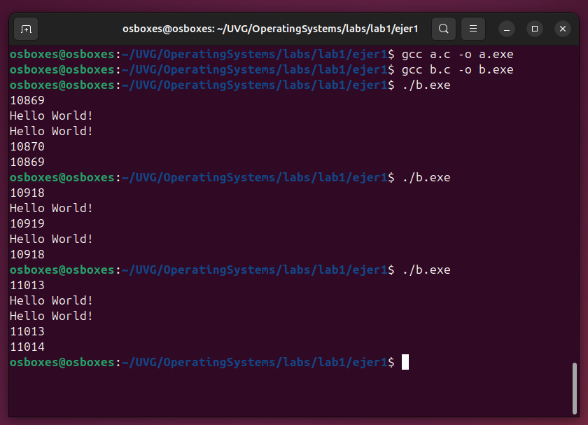

# Lab01 - Uso de C

## Ejercicio 1 - Parte a

**El código está en el archivo `a.c`.**

```bash
cd .\labs\lab1\ejer1\
```

### Explicación

- **`#include`**: Permite importar código de bibliotecas externas. En este caso, `stdio.h` se usa para operaciones de entrada y salida, y `unistd.h` para el manejo de procesos y llamadas al sistema.
- **Compilación**: Los archivos `.c` se convierten en código objeto `.o` o ejecutables `.exe`, y el **linker** une estos archivos para crear el ejecutable.
- **`main`**: Es el punto de entrada del programa, el retorno es obligado y el valor 0 para ejecución exitosa y != 0 para ejecución NO exitosa.
- **`printf`**: Imprime texto en la salida estándar.
- **`getpid()`**: Obtiene el identificador del proceso (PID) actual.

## Ejercicio 1 - Parte b

**El código está en el archivo `b.c`.**

```bash
cd .\labs\lab1\ejer1\
```

### Explicación

#### Fork

`fork()` crea un nuevo proceso.

- El **proceso padre** recibe el PID del hijo.
- El **proceso hijo** recibe `0`, indicando que es hijo.

```c
int pFork = fork();
if (pFork != 0) {
    // Código del padre
} else {
    // Código del hijo
}
```

#### Exec

`exec` reemplaza el proceso actual por otro programa.

##### Sintaxis de `execl`

```c

/*
  El arg puede ser opcional ya que el ejecutable que manda a llamar no necesita un arg pero para evitar
  warnings en consola se agregó como buena práctica el mismo nombre del ejecutable.
*/

int execl(const char *path, const char *arg0, ..., (char *)NULL);
```

## Ejercicio 1 - Parte c

Se compilaron los dos archivos c:

```bash
gcc a.c -o a.exe
gcc b.c -o b.exe
```

Se ejecutaron los archivos correspondientes:

```bash
./a.exe
./b.exe
```

- **¿Por qué aparecen números diferentes al ejecutar el primer programa varias veces?**
  - 
  - Cada ejecución recibe un PID único asignado por el sistema.

- **¿Por qué aparecen dos números distintos en el segundo programa?**
  - 
  - `fork()` crea un proceso hijo que ejecuta el mismo código que el padre.

- **¿Por qué el primer y segundo número son iguales?**
  - El mismo proceso imprime su PID antes y después de `execl()`.

- **¿Para qué sirve el proceso con PID 1 en [`top`](https://vagga-readthedocs-io.translate.goog/en/latest/pid1mode.html?_x_tr_sl=en&_x_tr_tl=es&_x_tr_hl=es&_x_tr_pto=sge#:~:text=%C2%BFQu%C3%A9%20tiene%20de%20especial%20el,tienen%20una%20para%20PID%201.)?**
  - 
  - Es el primer proceso iniciado por el kernel y adopta procesos huérfanos; además si el PID 1 muere, todos los demás procesos también lo harán.

## Ejercicio 2 - Parte a

| Función | Descripción |
|---------|------------|
| `open()`  | Abre o crea un archivo. |
| `close()` | Cierra un archivo. |
| `read()`  | Lee datos desde un archivo. |
| `write()` | Escribe datos en un archivo. |

>**Nota:** La investigación mas detallada esta en el archivo `documentation_c.md`.

## Ejercicio 2 - Parte b

**El código está en el archivo `b.c`.**

```bash
cd .\labs\lab1\ejer2\
gcc .\b.c -o b.exe
.\b.exe origen.txt destino.txt
```


### Explicación

1. **Verificación de argumentos:**  
   - El programa requiere dos argumentos: `archivo_origen` y `archivo_destino`.  
   - Si no se proporcionan, muestra un mensaje de error y termina.  

2. **Abrir el archivo de origen:**  
   - `open(argv[1], O_RDONLY)`: Abre el archivo en modo solo lectura.  
   - Si falla, se muestra un error.  

3. **Obtener tamaño del archivo:**  
   - `fstat(descriptorFile, &st)`: Llena la estructura `stat` con información del archivo.  
   - `st.st_size`: Contiene el tamaño del archivo en bytes.  

4. **Asignación de memoria:**  
   - `malloc(fileSize + 2)`: Reserva memoria para almacenar el contenido del archivo más un `\n`.  
   - Si `malloc` falla, muestra un error y termina.  

5. **Leer el contenido del archivo:**  
   - `read(descriptorFile, buffer, fileSize)`: Carga el contenido en `buffer`.  
   - Si falla, se muestra un error.  
   - Se agrega un salto de línea `buffer[bRead] = '\n';`.  

6. **Abrir el archivo de destino:**  
   - `open(argv[2], O_WRONLY | O_CREAT | O_APPEND, 0777)`:  
     - `O_WRONLY`: Modo escritura.  
     - `O_CREAT`: Crea el archivo si no existe.  
     - `O_APPEND`: Agrega contenido al final del archivo.  
     - `0777`: Permisos de lectura, escritura y ejecución para todos.  

7. **Escribir en el archivo de destino:**  
   - `write(descriptorDest, buffer, bRead + 1)`: Escribe el contenido leído más el salto de línea.  
   - Si falla, muestra un error.  

8. **Liberar recursos:**  
   - `free(buffer)`: Libera la memoria asignada.  
   - `close(descriptorFile)`: Cierra el archivo de origen.  
   - `close(descriptorDest)`: Cierra el archivo de destino.  

## Ejercicio 2 - Parte c

### [¿Qué es Strace?](https://wiki.ubuntu.com/Strace)

Comandos para rastrear llamadas a sistemas y señales de un proceso para depurar y analizar como se comporta un programa a nivel de sistema operativo.

### Instalando `strace`

```bash
sudo apt update
sudo apt upgrade
sudo apt-get install strace
```


## Ejercicio 2 - Parte d

Ejecute los siguientes comandos:

```bash
cd .\labs\lab1\ejer2\
gcc .\b.c -o b.o
strace ./b.o origen.txt destino.txt | tee logB.txt
```

### Observaciones

1. **Resultado del comando `strace`**  
   Se observará el retorno del comando `strace`, el archivo modificado `destino.txt` y el `logB.txt` para ver el resultado de la instrucción `strace`.

2. **Verificación y compilación de archivos**  

   

3. **Ejecución de la instrucción `strace`**  

   

4. **Resultado del archivo destino**  

   

### Preguntas

1. **Primera llamada a `execve`**  
   - ¿Por qué la primera llamada que aparece es `execve`?

2. **Llamadas de sistema realizadas por usted**  
   - Ubique las llamadas de sistema que ha realizado.  
   - ¿Qué significan los resultados (números que aparecen después del signo `=`)?

3. **Llamada `read` vacía**  
   - ¿Por qué entre las llamadas realizadas por usted hay una llamada `read` sin datos?

4. **Servicios del sistema operativo identificados en el `strace`**  
   - Identifique tres servicios distintos provistos por el sistema operativo en el `strace`.  
   - Liste y explique brevemente las llamadas a sistema que corresponden a los servicios identificados.  
   - Puede incluir llamadas como `read`, `write`, `open` o `close` que el sistema haya realizado por usted, no aquellas generadas directamente por su programa.
