# Ejercicio 3

## **1️⃣ Configuración inicial**

Se inició con un sistema Ubuntu y el objetivo de compilar un kernel personalizado (`6.8.0`) con un syscall llamado `hello`.

### **Comandos iniciales**

1. Actualización e instalación de dependencias esenciales:

   ```bash
   sudo apt update && sudo apt upgrade -y
   sudo apt install build-essential vim git cscope libncurses-dev libssl-dev bison flex -y
   sudo apt install dwarves -y
   sudo apt clean && sudo apt autoremove -y
   ```

2. Clonación del código fuente del kernel (`6.8`):

   ```bash
   git clone --depth=1 --branch v6.8 https://git.kernel.org/pub/scm/linux/kernel/git/torvalds/linux.git
   cd linux
   ```

   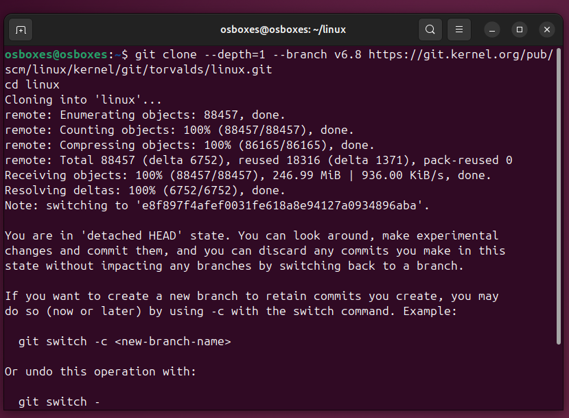

3. Preparación del código fuente:

   ```bash
   make mrproper
   ```

---

## **2️⃣ Creación del syscall**

Se agregó un syscall llamado `hello`:

1. Creación de un directorio y archivo de syscall:

   ```bash
   mkdir hello
   cd hello
   vim hello.c
   ```

   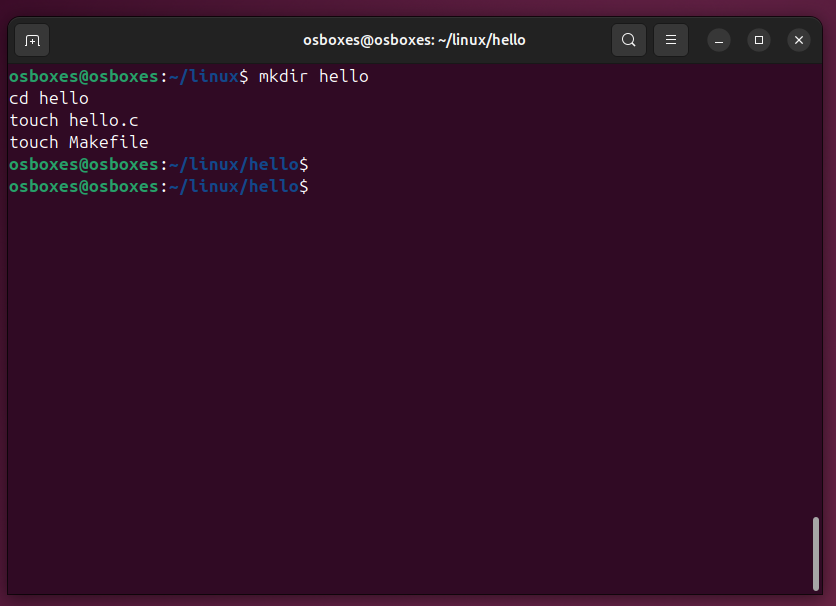

   **Contenido de `hello.c`:**

   ```c
   #include <linux/kernel.h>
   #include <linux/syscalls.h>

   SYSCALL_DEFINE0(hello) {
       pr_info("Hello World\n");
       return 0;
   }
   ```

2. Creación del `Makefile`:

   ```bash
   vim Makefile
   ```

   **Contenido de `Makefile`:**

   ```makefile
   obj-y := hello.o
   ```

   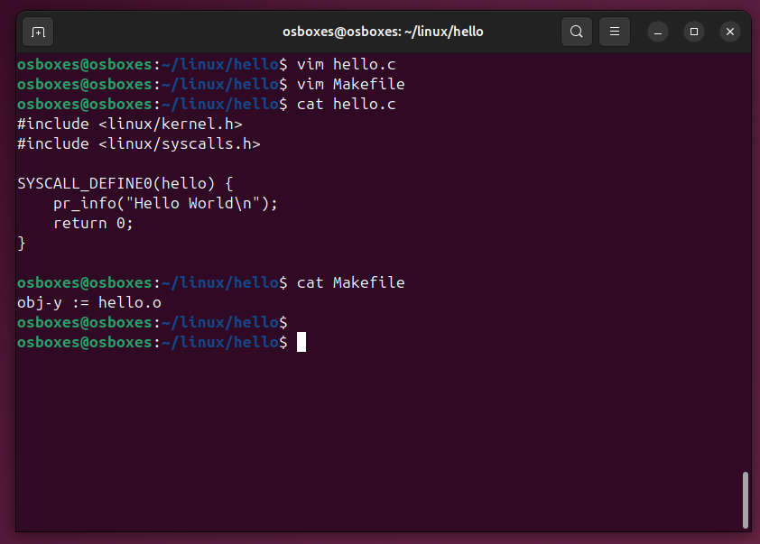

3. Registro del syscall en los siguientes archivos:

   - **`include/linux/syscalls.h`**: Se agregó la declaración:

     ```c
     asmlinkage long sys_hello(void);
     ```

    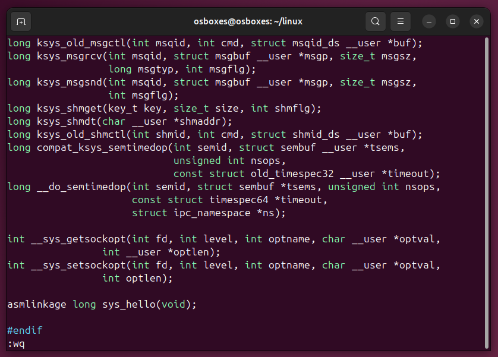

   - **`arch/x86/entry/syscalls/syscall_64.tbl`**: Se agregó la línea:

     ```bash
     548    common    hello    sys_hello
     ```

    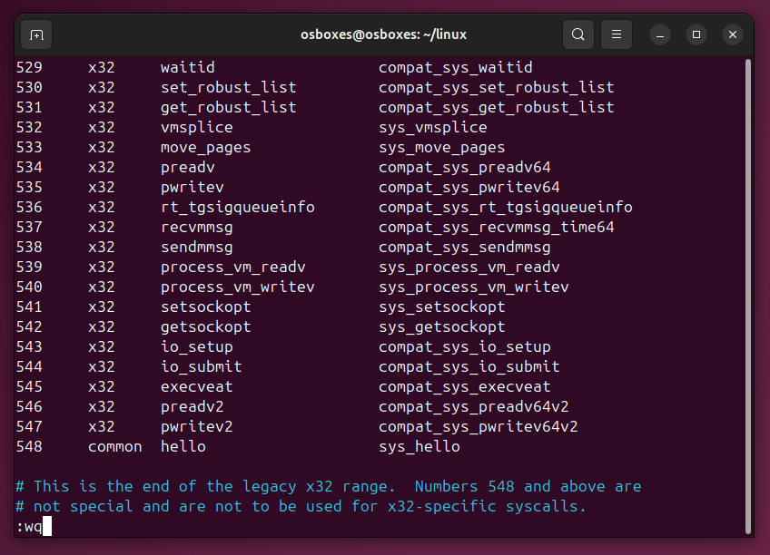

4. **`Kbuild`**
   Se agregó la referencia al directorio del syscall para que sea compilado por el sistema de construcción del kernel:

   ```bash
   vim Kbuild
   ```

   **Contenido agregado al final del archivo `Kbuild`:**

   ```makefile
   obj-y += hello/
   ```

   Esto asegura que el sistema de construcción (`make`) incluya el directorio del syscall durante la compilación.

   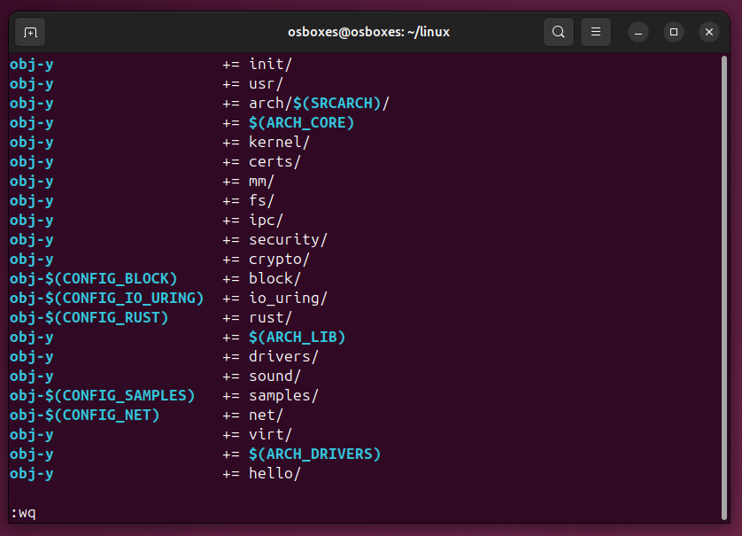

5. Modificación de la configuración del kernel para soportar el syscall:

   ```bash
   cp /boot/config-$(uname -r) .config
   make olddefconfig
   make menuconfig
   ```

   > Nota: el Makefile que se crea a partir de este se configura un Extraversion a -21K1234, permitiendo diferenciar el kernel personalizado de otros kernels instalados en el sistema.

   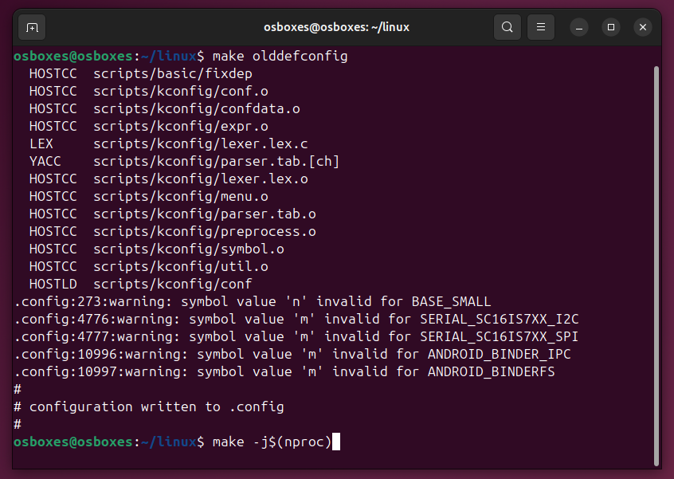

   **Ajustes en `menuconfig`:**
   - Se eliminó el contenido `Debian` de las claves ya que se usó ubuntu en el archivo `.config`:

     ```bash
     CONFIG_SYSTEM_TRUSTED_KEYS=""
     CONFIG_SYSTEM_REVOCATION_KEYS=""
     ```

---

## **3️⃣ Compilación del kernel**

1. Compilación del kernel:

   ```bash
   make -j$(nproc)
   ```

   **Error encontrado:**

   ```bash
   fatal error: libelf.h: No such file or directory
   ```

   **Solución:**
   Instalación de las librerías necesarias:

   ```bash
   sudo apt install libelf-dev libelf1 -y
   sudo apt install pahole -y
   ```

   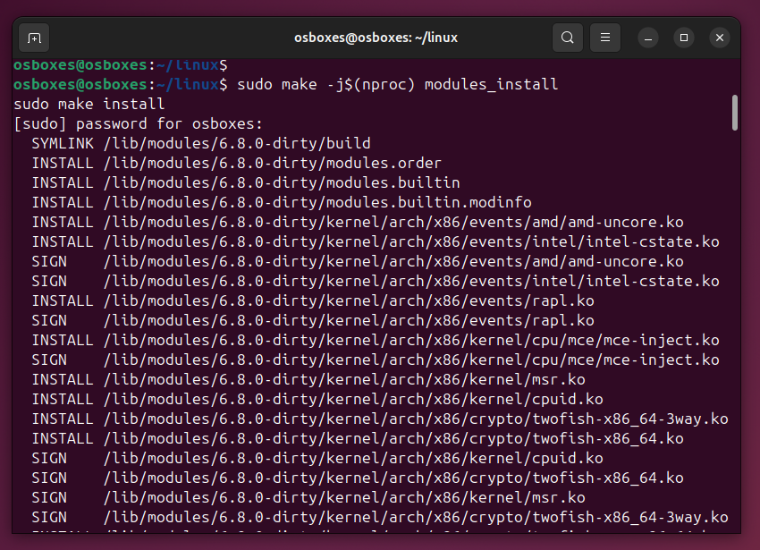

2. Limpieza y recompilación:

   ```bash
   make mrproper
   cp /boot/config-$(uname -r) .config
   make olddefconfig
   make -j$(nproc)
   ```

   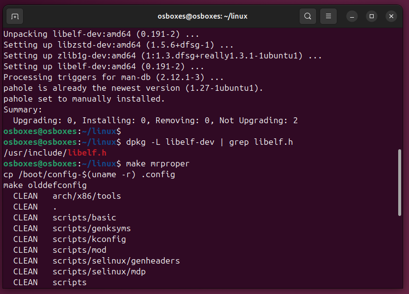

3. Instalación del kernel y módulos:

   ```bash
   sudo make -j$(nproc) modules_install
   sudo make install
   ```

   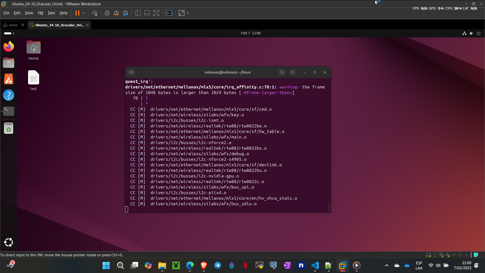

---

## **4️⃣ Problemas al arrancar con el nuevo kernel**

Después de reiniciar y seleccionar el kernel `6.8.0-dirty` en GRUB, el sistema entró en la consola `initramfs`.

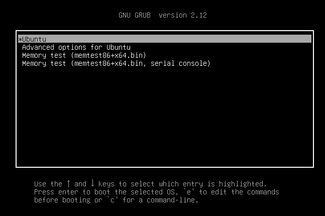

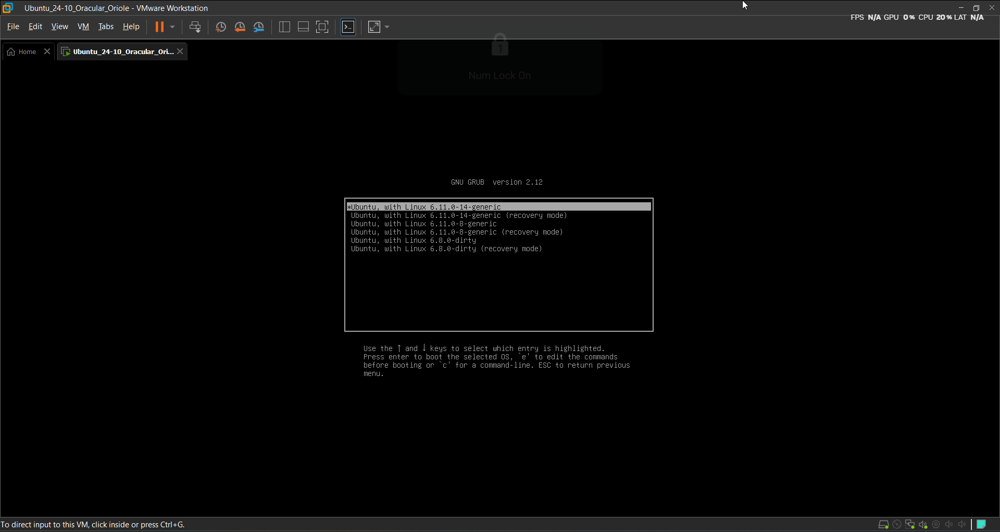

**Causa:**
El kernel no pudo encontrar el sistema de archivos raíz debido a módulos o configuraciones faltantes. Esto debido a que en la compilación del nuevo Kernel parece que hubo un error y no se compiló de manera adecuada, dondes se refleja al no encontrar la partición del kernel.

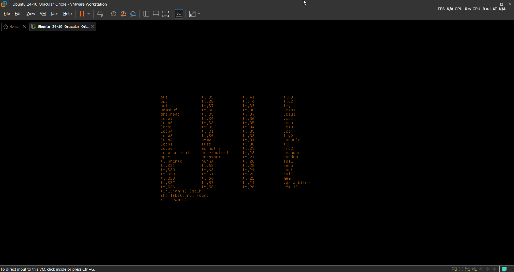

> Nota:  Las referencias fueron dadas a este [Video](https://www.youtube.com/watch?v=mK2Oe9DzvrY) y este [Blog](https://medium.com/@aryan20/create-custom-system-call-on-linux-6-8-126edef6caaf).
