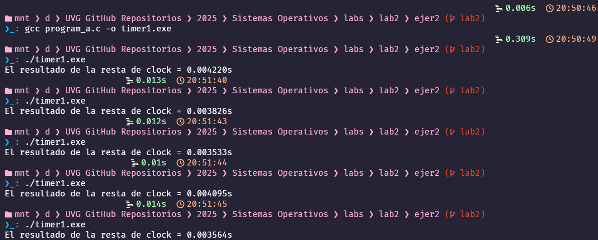
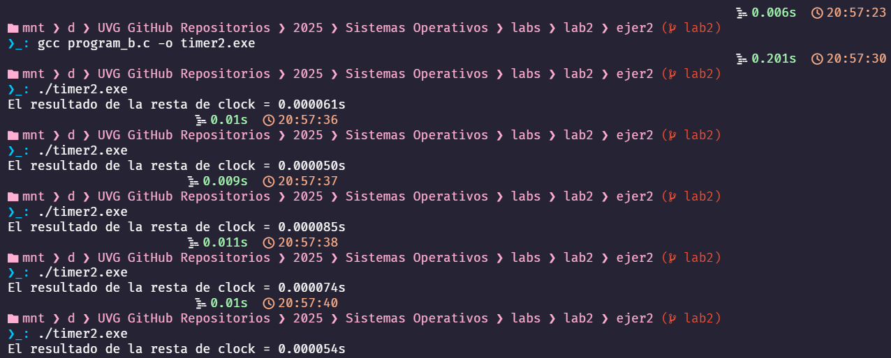

# Ejercicio 2

## Inciso 1 - For's Consecutivos

Realizando un programa con 3 `for` consecutivos con 1 millón de iteraciones, tomando el tiempo que ha transcurrido desde el primer `for` hasta que se acaban los 3, usando la librería `time` e imprimiendo la resta de estos tiempos en la pantalla. Se ejecutó varias veces dicho programa obteniendo estos resultados:

| Ejecución | Resultado  |
|-----------|------------|
| 1         | 3532.000000|
| 2         | 4354.000000|
| 3         | 3886.000000|
| 4         | 3680.000000|
| 5         | 3785.000000|

## Inciso 2 - For's Concurrentes

En este ejercicio, se desarrolló un programa que crea procesos hijos, generando una jerarquía de bisnietos. Cada hijo ejecuta un ciclo `for`, mientras que cada proceso padre espera a que su hijo termine su ejecución antes de continuar. El tiempo se mide desde antes de la creación del primer hijo hasta que el proceso raíz (el padre) termina de esperar a todos sus hijos, utilizando la librería `time`. Se ejecutó varias veces dicho programa obteniendo estos resultados:

| Ejecución | Resultado  |
|-----------|------------|
| 1         | 78.000000|
| 2         | 61.000000|
| 3         | 98.000000|
| 4         | 55.000000|
| 5         | 95.000000|

## Preguntas

- **¿Cuál, en general, toma tiempos más largos?**

    Los ciclos `for` consecutivos toman un tiempo mucho mayor que los `for` concurrentes.

- **¿Qué causa la diferencia de tiempo, o por qué se tarda más el que se tarda más?**

  - En los `for's` consecutivos, cada ciclo espera a que el anterior termine antes de comenzar el siguiente, lo que hace que el tiempo sea secuencial y dependiente que cada for se termine.
  - En cambio, en los `for's` concurrentes, los procesos hijos se ejecutan sus `for` desde el momento en que se crean, sin tener que esperar a que los otros procesos terminen. Obvio los procesos padres tienen que esperar a que sus hijos terminen, pero esta espera es mínima porque los procesos hijos comienzan a ejecutarse casi al mismo tiempo y terminan en sincronía.
