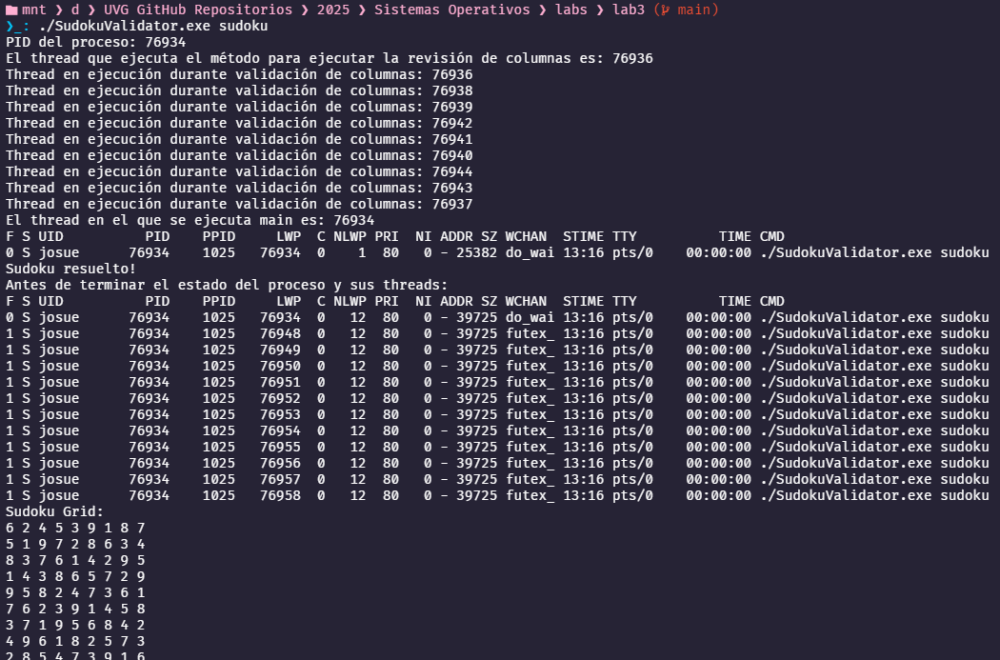
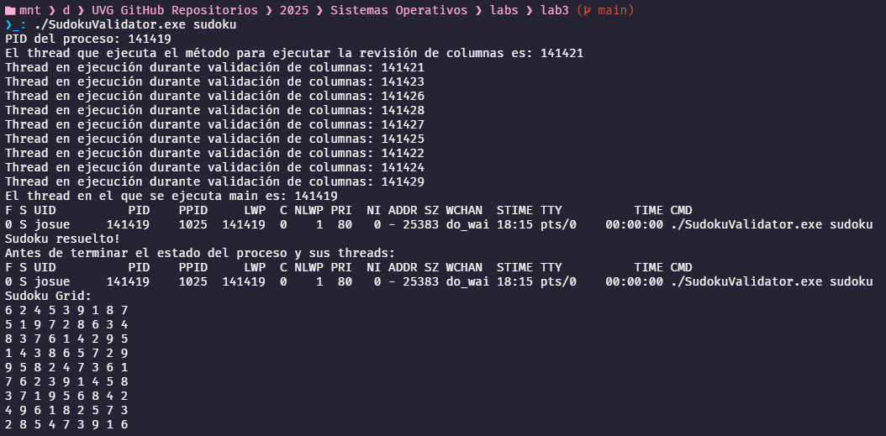

# Laboratorio 3 - Validación de Sudoku con Hilos y Paralelismo

Este laboratorio tiene como objetivo aplicar conceptos de multithreading y paralelismo utilizando Pthreads y OpenMP. Se parte de un programa secuencial que valida una solución de Sudoku y se transforma gradualmente para usar múltiples hilos, observando el comportamiento del sistema durante su ejecución.

## Fase 1: Lectura y carga del Sudoku

- Se mapeó el archivo `sudoku` usando `mmap()`.
- Se cargó en un arreglo 2D `sudokuGrid[9][9]`.
- Se imprimió la grilla correctamente formateada en consola.


## Fase 2: Validación concurrente con Pthread y monitoreo con `ps`

- Se creó un hilo (`pthread`) para validar las columnas.
- Se utilizó un `fork()` para ejecutar el comando `ps -p <PID> -lLf` antes y después del procesamiento.
- Se observó cómo el número de LWP (`NLWP`) cambia durante y después de la validación.


## Fase 3: Paralelización con OpenMP

- Se añadió `#pragma omp parallel for` a los ciclos que validan filas, columnas y subgrillas.
- Se usaron las directivas `private(i)` y `reduction(&& : variable)` para evitar race conditions.
- Se observó concurrencia real mediante múltiples TID durante validación.



## Fase 4: Ajuste de configuración avanzada en OpenMP

Se implementaron configuraciones más específicas para observar su efecto:

- `omp_set_num_threads(1);` en `main()`.
- `omp_set_num_threads(9);` en funciones paralelas.
- `omp_set_nested(true);` para permitir anidamiento.
- `schedule(dynamic)` en todos los ciclos paralelos.

Estas configuraciones permitieron comparar el comportamiento de los hilos creados y el número de LWP capturados con `ps`.



## Observaciones

| Momento de ejecución `ps`             | NLWP | Observaciones |
|--------------------------------------|------|---------------|
| Justo después del `pthread_join()`   | 1    | Los hilos OpenMP ya habían terminado |
| Antes de terminar (`fork` final)     | 12   | Hilos OpenMP seguían vivos y fueron capturados |

- Se observa concurrencia real (distintos TID).
- OpenMP maneja un *thread team* para ejecutar las tareas paralelas.
- El uso de `schedule(dynamic)` cambió el reparto de trabajo entre los hilos.
- La configuración de `omp_set_num_threads()` y `omp_set_nested()` afectó directamente la cantidad y comportamiento de los hilos.

## Recomendaciones y conclusiones

- Es fundamental utilizar `private` y `reduction` en OpenMP para evitar **race conditions**.
- `ps -lLf` permite inspeccionar los **LWP reales** y confirmar el multithreading.
- `schedule(dynamic)` distribuye mejor la carga, pero su efecto depende del número de iteraciones e hilos disponibles.
- Limitar el número de threads a 1 permite observar claramente la diferencia entre ejecución secuencial y concurrente.
- `omp_set_nested(true)` permite anidar regiones paralelas, aunque su efecto se limita a ciertos contextos.

## Archivos

- `sudokuValidator.c`: Código fuente.
- `sudoku`: Archivo de entrada con solución.
- `docs/parte1.md` a `parte4.md`, `preguntas.md` y `movimiento.md`: Explicaciones detalladas.
- `images/`: Evidencia gráfica del laboratorio.

## Compilación

```bash
gcc -fopenmp sudokuValidator.c -o SudokuValidator.exe -lpthread
```

## Ejecución

```bash
./SudokuValidator.exe sudoku
```
