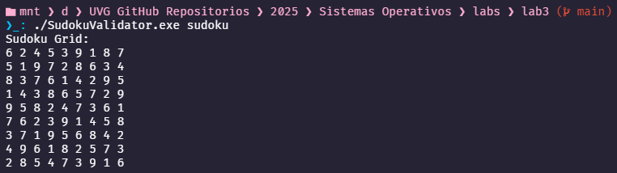

# Documentación: `SudokuValidator.c`

Este programa en lenguaje C tiene como objetivo leer desde un archivo la solución propuesta para un Sudoku de 9x9, cargarla en una estructura bidimensional en memoria, e imprimirla como una grilla para su visualización. Además, se definen funciones para validar filas, columnas y subarreglos 3x3, aunque en esta versión no se utilizan directamente en el `main()`.

> El archivo `sudoku` debe estar en el mismo directorio o indicarse su ruta relativa/absoluta.



## Estructura del Código

### 1. Definiciones y Variables Globales

```c
#define SIZE 9
#define SUBGRID_SIZE 3
int sudokuGrid[SIZE][SIZE];
```

- `SIZE`: Tamaño de la grilla de Sudoku (9 filas por 9 columnas).
- `SUBGRID_SIZE`: Tamaño de cada subgrilla (3x3).
- `sudokuGrid`: Arreglo bidimensional global donde se almacena la grilla del Sudoku.

### 2. Función `loadSudokuGridFromFile()`

```c
void loadSudokuGridFromFile(char *fileData)
```

Esta función recorre los primeros 81 caracteres del archivo y los convierte en enteros para llenar la grilla `sudokuGrid`, usando aritmética de división y módulo para ubicar correctamente cada número en su fila y columna correspondientes.

### 3. Función `printSudoku()`

```c
void printSudoku()
```

Imprime el contenido de `sudokuGrid` en formato de grilla 9x9, separando los números con espacios.

### 4. Funciones de Validación

Estas funciones no son utilizadas en el `main()`, pero están disponibles para su uso futuro:

#### a. Validación de filas

```c
int validateRow(int row)
```

Verifica si una fila contiene todos los dígitos del 1 al 9 sin repeticiones.

#### b. Validación de columnas

```c
int validateColumn(int col)
```

Verifica si una columna contiene todos los dígitos del 1 al 9 sin repeticiones.

#### c. Validación de subgrillas 3x3

```c
int validateSubgrid(int startRow, int startCol)
```

Verifica si una subgrilla 3x3 (esquina superior en `startRow`, `startCol`) contiene todos los dígitos del 1 al 9 sin repeticiones.

### 5. Función `main()`

```c
int main(int argc, char *argv[])
```

- Verifica que se reciba como argumento la ruta al archivo de entrada.
- Abre el archivo con `open()` y mapea su contenido en memoria usando `mmap()`.
- Llama a `loadSudokuGridFromFile()` para llenar `sudokuGrid`.
- Imprime la grilla con `printSudoku()`.
- Libera los recursos con `munmap()` y `close()`.

## Ejemplo de Salida

Si el archivo contiene:

```bash
624539187519728634837614295143865729958247361762391458371956842496182573285473916
```

El programa imprimirá:

```bash
Sudoku Grid:
6 2 4 5 3 9 1 8 7
5 1 9 7 2 8 6 3 4
8 3 7 6 1 4 2 9 5
1 4 3 8 6 5 7 2 9
9 5 8 2 4 7 3 6 1
7 6 2 3 9 1 4 5 8
3 7 1 9 5 6 8 4 2
4 9 6 1 8 2 5 7 3
2 8 5 4 7 3 9 1 6
```

## Referencias

1. [Why does subtracting '0' convert char to int](https://stackoverflow.com/questions/15598698/why-does-subtracting-0-in-c-result-in-the-number-that-the-char-is-representing)  
2. [Recorrer arreglo bidimensional usando punteros en C](https://es.stackoverflow.com/questions/271213/c-recorrer-arreglo-bidimensional-usando-punteros)

## Documentación adicional

1. [Recorrido de un arreglo bidimensional](movimiento.md)
