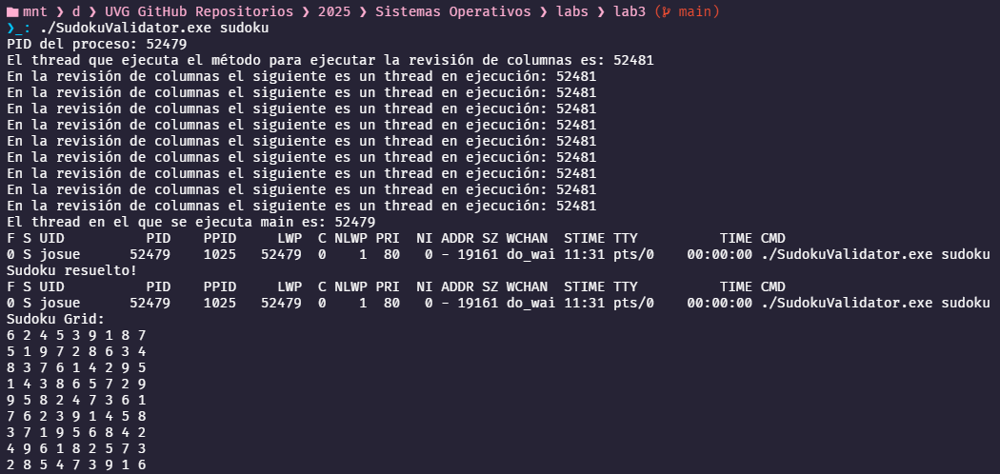

# Documentación: Verificación Multihilo y Monitoreo de Proceso

En esta segunda fase del programa `SudokuValidator.c`, se amplía la funcionalidad incluyendo verificación multihilo de columnas usando `pthread`, validación secuencial de filas y subcuadros 3x3, y el uso de procesos (`fork()`) para ejecutar el comando `ps -p <PID> -lLf`. Esto permite monitorear los lightweight processes (LWP) asociados al proceso padre durante la ejecución y al finalizar.



## Estructura del Código

### 1. Función `threadValidateColumns`

```c
void *threadValidateColumns(void *arg)
```

- Recibe como argumento un puntero a un entero que se usa como bandera para validar o invalidar el proceso.
- Dentro de un `for`, llama a `validateColumn()` para cada columna.
- Si alguna columna falla, actualiza la bandera a 0.
- Imprime el ID del thread en ejecución usando `syscall(SYS_gettid)`.
- Termina con `pthread_exit(0)`.

### 2. Primer `fork()`

```c
pid = fork();
```

- En el proceso hijo, se convierte el PID del proceso padre a string con `snprintf()`.
- Se ejecuta `execlp("ps", "ps", "-p", pid_str, "-lLf", NULL)` para mostrar información del proceso padre.
- El comando `ps` permite ver cuántos threads (LWP) están activos en ese momento.

### 3. Proceso Padre

- Crea un `pthread` para la validación de columnas.
- Usa `pthread_join()` para esperar a que el hilo finalice.
- Muestra el ID del thread principal con `syscall(SYS_gettid)`.
- Espera al proceso hijo que ejecutó `ps` con `wait(NULL)`.

### 4. Validación de Filas

```c
int filas_validas = 1;
for (int i = 0; i < SIZE; i++) {
  if (!validateRow(i)) {
    filas_validas = 0;
    break;
  }
}
```

Valida que cada fila contenga todos los números del 1 al 9 sin repeticiones.

### 5. Validación de Subarreglos

```c
int subgrids_validos = 1;
for (int i = 0; i < SIZE; i += 3) {
  for (int j = 0; j < SIZE; j += 3) {
    if (!validateSubgrid(i, j)) {
      subgrids_validos = 0;
      break;
    }
  }
}
```

Valida los subarreglos 3x3 empezando en posiciones (0,0), (0,3), (0,6), ..., siguiendo el patrón para cubrir toda la grilla.

### 6. Evaluación de la Solución

```c
if (filas_validas && columnas_validas && subgrids_validos)
  printf("Sudoku resuelto!\n");
else
  printf("Sudoku inválido.\n");
```

Verifica si todas las condiciones fueron satisfechas para declarar la solución como válida.

### 7. Segundo `fork()`

Se lanza un segundo proceso hijo que ejecuta `ps -p <PID> -lLf` para observar los LWP activos al finalizar el programa. Esto permite comparar con el número de threads observados anteriormente.

## Ejemplo de Salida

```bash
PID del proceso: 52479
El thread que ejecuta el método para ejecutar la revisión de columnas es: 52481
En la revisión de columnas el siguiente es un thread en ejecución: 52481
...
El thread en el que se ejecuta main es: 52479
F S UID   PID  PPID   LWP NLWP ... CMD
0 S user 52479 1025  52479    2  ... ./SudokuValidator.exe sudoku
Sudoku resuelto!
F S UID   PID  PPID   LWP NLWP ... CMD
0 S user 52479 1025  52479    1  ... ./SudokuValidator.exe sudoku
```

Se observa que durante la validación con `pthread`, hay más de un LWP, y al finalizar, vuelve a uno solo.

## Referencias

1. [`pthread` y manejo de hilos en C](https://man7.org/linux/man-pages/man3/pthread_create.3.html)  
2. [`ps -lLf`](https://man7.org/linux/man-pages/man1/ps.1.html)  
3. [`syscall(SYS_gettid)`](https://man7.org/linux/man-pages/man2/gettid.2.html)
