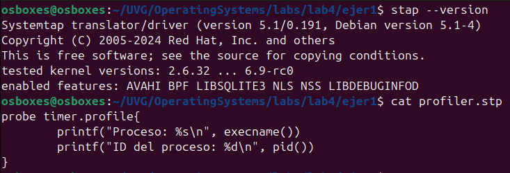

# Ejercicio 1

## Instalando SystemTap y Ejecutando el Código



```bash
# Procesos de usuario/GUI que reflejan acciones visibles
Proceso: gnome-shell        # ID: 2954 - Interfaz gráfica principal (acciones en escritorio, mover ventanas)
Proceso: gnome-terminal-    # ID: 3961 - Terminal donde se ejecutó SystemTap
Proceso: gnome-text-edit    # ID: 22547 - Editor de texto usado (escribir y guardar)
Proceso: sudo               # ID: 22823 - Elevación de privilegios para ejecutar SystemTap
Proceso: kworker/u513:0     # ID: 22852 - Worker del kernel, tareas en background

# Procesos del sistema (núcleo/idle)
Proceso: swapper/0
Proceso: swapper/1
Proceso: swapper/2
Proceso: swapper/3
Proceso: KMS thread
```

## Preguntas

**¿Qué puede ver en el output cuando realiza estas acciones?**  
Se observa una lista constante de procesos que están activos o se ejecutan periódicamente, como `swapper`, `gnome-terminal`, `gnome-shell`, `sudo`, entre otros. Esto muestra qué procesos están utilizando la CPU en ese momento, incluso si solo están en espera o haciendo tareas mínimas.

**¿Para qué sirve SystemTap?**  
SystemTap sirve para **monitorear y analizar el comportamiento interno del sistema operativo** (como el kernel y procesos) en tiempo real, sin necesidad de modificar o recompilar el código fuente.

**¿Qué es una probe?**  
Una *probe* es una combinación de **evento + acción**.  
Es decir, SystemTap vigila un evento (como un temporizador o una llamada al sistema) y ejecuta un bloque de código (handler) cuando ese evento ocurre.

**¿Cómo funciona SystemTap?**  
SystemTap funciona insertando temporalmente "instrumentación" en el sistema (como printf o registros), basada en un script `.stp` que define **qué eventos observar y qué hacer cuando sucedan**. En el script utilizado cada cierto tiempo (`timer.profile`), imprime el nombre e ID del proceso activo.

**¿Qué es hacer profiling y qué tipo de profiling se hace en este ejercicio?**  
Hacer *profiling* es recolectar datos sobre el rendimiento o comportamiento de un sistema.  
En este ejercicio se hace **profiling de CPU** porque se observa **qué procesos están usando la CPU periódicamente**.

## Referencias

1. **[SystemTap Scripts](https://sourceware.org/systemtap/SystemTap_Beginners_Guide/scripts.html)**
2. **[SystemTao Scripts Red Hat](https://docs.redhat.com/en/documentation/red_hat_enterprise_linux/7/html/systemtap_beginners_guide/scripts#systemtapscript-handler)**
