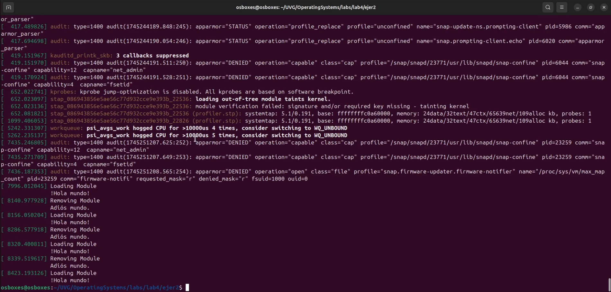
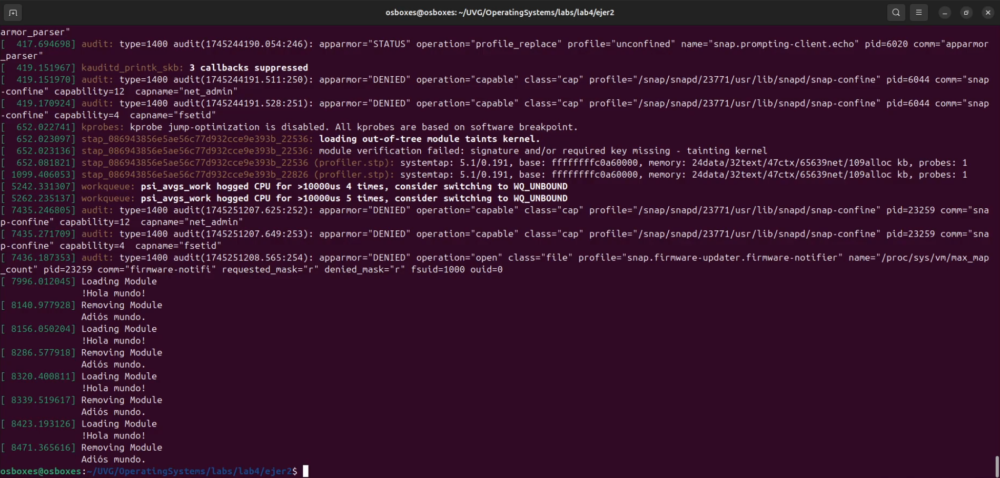

# Ejercicio 2

## Ejecución de Código

- **log1:** muestra el mensaje de **inicio/carga** del módulo.
- **log2:** muestra el mensaje de **salida/remoción** del módulo.

[**Enlace al Video**](https://youtu.be/Odw8Ir8OegQ)

### **Ejecución primer comando `sudo insmod simple.ko` y `sudo dmesg`**

Este log muestra el momento en que el módulo es **insertado** en el kernel con `insmod`. Hacia el final del log aparece la línea:

```bash
[XXXX.XXXXXX] Loading Module
[XXXX.XXXXXX] Hola desde el módulo simple!
```



Esto indica que la función `simple_init()` se ejecutó correctamente y que el módulo fue cargado, lo cual confirma que el `printk()` dentro de `simple_init` funcionó bien.

### **Ejecución segundo comando `sudo rmmod simple` y `sudo dmesg`**

En este log se observa cuando el módulo es **removido** con `rmmod`. Aparece:

```bash
[XXXX.XXXXXX] Removing Module
[XXXX.XXXXXX] Adiós desde el módulo simple!
```



Esto muestra que se ejecutó la función `simple_exit()` correctamente al quitar el módulo, y que el mensaje `printk()` correspondiente también se imprimió.

## Preguntas Parte 1

**¿Cuál es la diferencia en C entre un método que no recibe parámetros y uno que recibe void?**

- `int funcion()` → El compilador **no puede garantizar** que no se reciban argumentos.
- `int funcion(void)` → Especifica explícitamente que **no recibe ningún parámetro**. Es la forma correcta y segura.

**¿Qué diferencia hay entre `printk` y `printf`?**

- `printf()` es para **programas en espacio de usuario** (como `main.c`).
- `printk()` es para **espacio de kernel**, y se usa para imprimir mensajes que pueden verse con `dmesg`.

**¿Qué es y para qué sirve `KERN_INFO`?**

- `KERN_INFO` es un **nivel de prioridad** de mensajes del kernel (informativo). Sirve para **clasificar el mensaje** en los logs del sistema.

## Preguntas Parte 2

**¿Qué es una goal definition o definición de meta en un Makefile, y qué se está haciendo con la definición de meta `obj-m`?**  
Una *goal definition* define qué acción se va a realizar (como `all`, `clean`, etc).  
La línea `obj-m += simple.o` indica que se va a compilar un **módulo de kernel** llamado `simple.ko` usando el archivo fuente `simple.c`.

**¿Qué función tienen las líneas `all:` y `clean:`?**

- `all:` compila el módulo del kernel.
- `clean:` elimina los archivos generados (como `.o`, `.ko`, etc.).

**¿Qué hace la opción `-C` en este Makefile?**  
Cambia al directorio donde están los archivos del **kernel actual** para usar sus herramientas de compilación (`Makefile`, configuración, etc.).

**¿Qué hace la opción `M=$(PWD)` en este Makefile?**  
Indica que el módulo que se quiere compilar está en el **directorio actual** (`$(PWD)` → *print working directory*).

**¿Para qué sirve `dmesg`?**  
Muestra los mensajes del kernel.

**¿Qué hace la función `simple_init` en `simple.c`?**  
Muestra el mensaje `"Loading Module..."` con `printk()` en los logs del kernel.

**¿Qué hace la función `simple_exit` en `simple.c`?**  
Muestra el mensaje `"Removing Module..."` con `printk()`.

**¿Qué poder otorga el ejecutar código de esta forma?**  

Usar `make` es como tener un asistente que sabe qué archivos necesitan recompilarse cuando se hace un cambio en el código. Si se hace manualmente se debe poder recordar todo lo que depende de ese cambio y si el proyecto es grande son muchas cosas que se deben recompilar y recordar por ello `make` lo facilita.

## Referencias

1. **[Void como parámetro](https://es.stackoverflow.com/questions/160095/void-como-par%C3%A1metro-de-una-funci%C3%B3n)**
2. **[Printk y Printf](https://www.quora.com/What-is-the-difference-between-Printk-and-Printf-in-Linux)**
3. **[Kern Info](https://stackoverflow.com/questions/59626722/what-exactly-expands-the-kern-info-and-where-it-is-implemented)**
4. **[All - Clean en Makefile](https://stackoverflow.com/questions/45404569/creating-a-makefile-c-using-all-clean-and-other)**
5. **[M y -C en Makefile](https://stackoverflow.com/questions/20301591/m-option-in-make-command-makefile)**
6. **[Uso de dmesg](https://es.wikipedia.org/wiki/Dmesg)**
7. **[Uso de Makefile](https://old.chuidiang.org/clinux/herramientas/makefile.php)**
