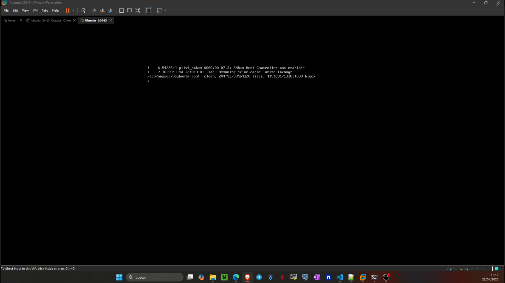
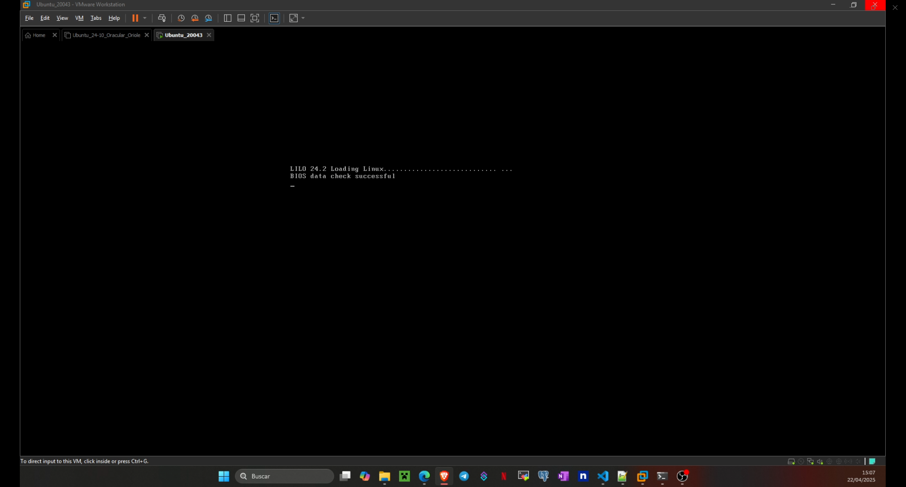
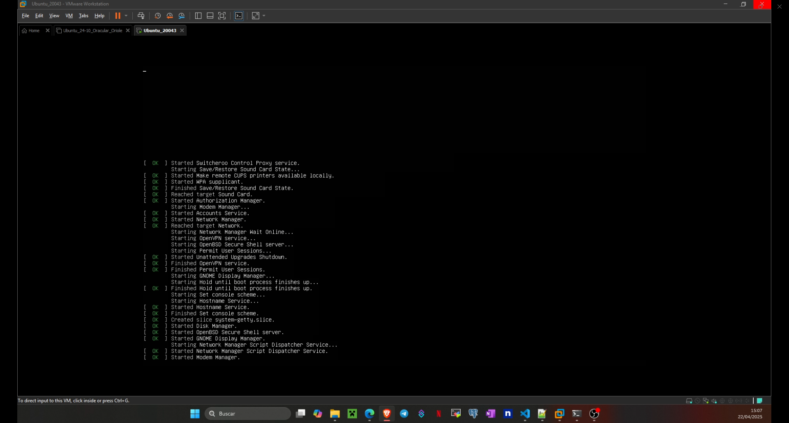
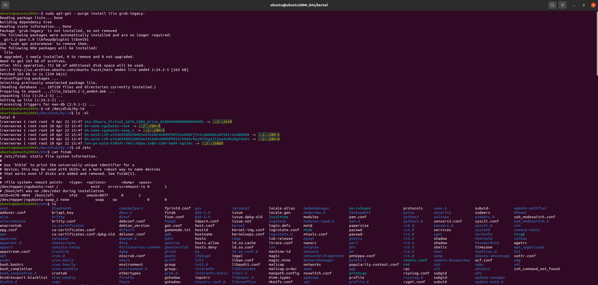
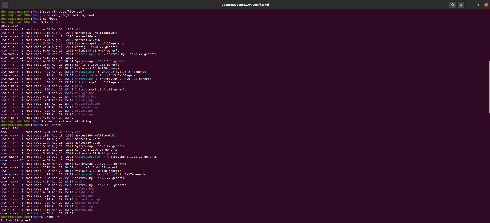
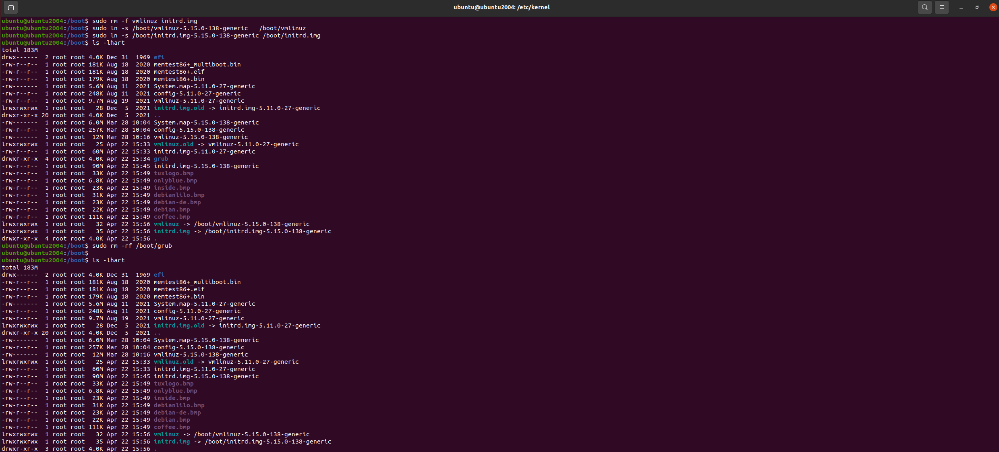
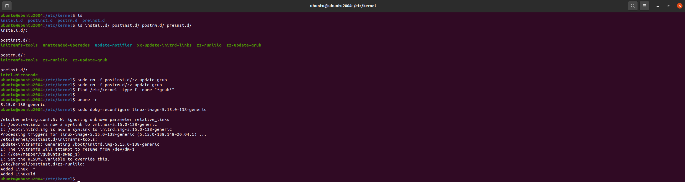

# Ejercicio 3

## Resultado

### Arranque con GRUB (sin LILO)

- [**Video: Arranque inicial con GRUB (sin LILO)**](https://youtu.be/21qShr-zH7s)

En este escenario, el sistema utiliza el gestor de arranque por defecto (GRUB). Se muestra el menú de selección de kernel antes de iniciar el sistema operativo.



### Arranque con LILO tras configuración

- [**Video: Arranque con LILO tras la configuración**](https://youtu.be/QT-rmeLOdDM)

Aquí aparece el prompt de LILO (“LILO 24.2” con guion parpadeando). Pasado el tiempo de espera o al pulsar Enter, muestra “LOADING LINUX” y arranca directamente el kernel sin menú de selección.




## Procedimiento

### 1. Instalar GRUB-PC

```bash
sudo apt-get --purge install lilo grub-legacy-
```

### 2. Identificar el disco principal

```bash
cd /dev/disk/by-id
ls -Al
```

Buscar el enlace simbólico que apunte a `../../sda` (sin "partN").

### 3. Revisar configuración de particiones

```bash
cat /etc/fstab
```

Buscar la línea donde el punto de montaje (`/`) aparece, y anotar el `<file system>` (por ejemplo: `/dev/disk/by-uuid/...`).



### 4. Crear archivo `/etc/lilo.conf`

```bash
sudo vim /etc/lilo.conf
```

Contenido:

```bash
boot=/dev/sda
compact
default=Linux
delay=40
install=menu
large-memory
lba32
map=/boot/map
root="/dev/mapper/vgubuntu-root"
read-only
vga=normal
image=/boot/vmlinuz
    label=Linux 
    initrd=/boot/initrd.img 
image=/boot/vmlinuz.old
    label=LinuxOld 
    initrd=/boot/initrd.img.old 
    optional
```

### 5. Modificar `/etc/kernel-img.conf`

```bash
sudo vim /etc/kernel-img.conf
```

Agregar:

```conf
do_symlinks = yes
relative_links = yes
link_in_boot = yes
```

### 6. Limpiar y recrear links simbólicos del kernel

```bash
cd /boot
sudo rm -f vmlinuz initrd.img
uname -r  # Anotar versión actual del kernel
```



Ejemplo:

```bash
sudo ln -s /boot/vmlinuz-5.15.0-138-generic   /boot/vmlinuz
sudo ln -s /boot/initrd.img-5.15.0-138-generic /boot/initrd.img
```

### 7. Eliminar configuración de GRUB

```bash
sudo rm -r /boot/grub
```



### 8. Limpiar scripts relacionados a GRUB

```bash
cd /etc/kernel
sudo rm -f postrm.d/zz-update-grub
sudo rm -f postinst.d/zz-update-grub
```

### 9. Reconfigurar imagen del kernel

```bash
sudo dpkg-reconfigure linux-image-5.15.0-138-generic
```

Esperar salida similar a:

```bash
/etc/kernel-img.conf:2: W: ignoring unknown parameter relative_links
I: /boot/vmlinuz.old is now a symlink to vmlinuz-5.15.0-138-generic
I: /boot/initrd.img.old is now a symlink to initrd.img-5.15.0-138-generic
...
```



## Preguntas

**¿Qué es y para qué sirve el archivo `/etc/fstab`?**  
Define qué volúmenes se montan, dónde y con qué opciones cada vez que se ejecuta `mount ‑a` (normalmente al arrancar).

**¿Qué almacena el directorio `/etc`?**  
Todos los archivos de configuración global del sistema y de los servicios.

**¿Quién funge como `/etc` en Windows?**  
El Registro (regedit), que centraliza la configuración del SO y de las aplicaciones.

**¿Qué se almacena en `/dev` y en `/dev/disk`?**  

- `/dev`: nodos de dispositivo para cada hardware.  

- `/dev/disk`: enlaces persistentes a discos/particiones organizados por *id*, *uuid*, *label*, *path*.

**¿Por qué usar la ruta completa en lugar de `/dev/sda`?**  
Los nombres `sda`, `sdb`… pueden cambiar; los enlaces en `by‑id`, `by‑uuid`, etc. son estables y evitan montar el disco equivocado.

**¿Qué es `udev` y cuál es su papel?**  
Gestor de dispositivos en espacio de usuario: detecta hardware, crea nodos en `/dev` y aplica reglas para nombrado persistente o acciones automáticas.

**¿Qué es un *block device* y qué significa `/dev/sdxN`?**  
Dispositivo que opera por bloques (discos, SSD). `sdxN` = disco `x` (a, b, c…) y partición `N` (1, 2…).

**¿Qué son MBR y VBR, y su relación con UEFI?**  

- **MBR:** primer sector con tabla DOS y código de arranque.  
- **VBR:** primer sector de cada partición que carga el SO.  
- **UEFI** sustituye al BIOS+MBR; usa GPT y archivos `.efi`, aunque puede emular MBR en modo CSM.

**¿Qué es *chain loading*?**  
Un cargador (GRUB, LILO) pasa el control a otro (p. ej. Windows Boot Manager) para permitir arranque dual.

**¿Qué indica `root="<file system>"` en `lilo.conf`?**  
Especifica la partición raíz que se montará tras arrancar; con `initrd` suele omitirse y conviene usar UUID si se necesita.

**¿Qué es `vmlinuz`?**  
La imagen del kernel de Linux comprimida (gzip); el gestor de arranque la carga y la descomprime en memoria como `vmlinux`.

**Diferencias entre LILO y GRUB**

- **Interfaz**  
  •  GRUB ofrece línea de comandos y menú interactivo para editar parámetros al vuelo;  
  •  LILO carece de modo interactivo – si falla la configuración no hay consola de rescate.

- **Actualización de la configuración**  
  •  En GRUB basta editar el `grub.cfg` (o regenerarlo) ; el cargador lee el archivo en cada arranque.  
  •  Con LILO hay que volver a ejecutar `/sbin/lilo` y re‑escribir el MBR cada vez que cambia el kernel o su ruta.

- **Alcance y soportes**  
  •  GRUB entiende varios sistemas de archivos, GPT/UEFI y puede arrancar por red (PXE).  
  •  LILO localiza el kernel por sectores físicos, no soporta arranque por red ni GPT, y obliga a que `/boot` esté dentro del área accesible por el BIOS.

## Referencias

- [**Guía detallada de `/etc/fstab` (FP GenRed)**](https://www.fpgenred.es/GNU-Linux/etcfstab.html)  
- [**Capítulo “/etc/fstab” – TLDP System Admin Guide (ES)**](https://tldp.org/pub/Linux/docs/ldp-archived/system-admin-guide/translations/es/html/ch04s03.html)  
- [**Explicación de `/dev/disk/by-*` – Unix & Linux SE**](https://unix.stackexchange.com/questions/86764/understanding-dev-disk-by-folders)  
- [**Introducción a udev y reglas personalizadas – Opensource.com**](https://opensource.com/article/18/11/udev)  
- [**¿Qué es un dispositivo de bloques? – Unix SE**](https://unix.stackexchange.com/questions/259193/what-is-a-block-device)  
- [**Significado de `/dev/sdx` – AskUbuntu**](https://askubuntu.com/questions/991016/what-is-disk-dev-sdx)  
- [**Artículo “Master Boot Record” (Wikipedia, ES)**](https://en-m-wikipedia-org.translate.goog/wiki/Master_boot_record?_x_tr_sl=en&_x_tr_tl=es&_x_tr_hl=es&_x_tr_pto=sge#:~:text=Este%20c%C3%B3digo%20MBR%20se%20conoce,plataformas%20que%20no%20sean%20PC.)  
- [**Manual GRUB – Chain loading**](https://www.gnu.org/software/grub/manual/grub/html_node/Chain_002dloading.html)  
- [**Búsqueda comparativa MBR/UEFI/VBR (Google)**](https://www.google.com/search?q=MBR+UEFI+VBR&sca_esv=cc91aa7b516a412e&sxsrf=AHTn8zpszWPsokHBPEfRkMzAsVRK0yTzLA%3A1745358367462&ei=Hw4IaMbuG9aqwbkPvNW_kAI)  
- [**Hilo “¿root= con initrd en LILO?” – LinuxQuestions**](https://www.linuxquestions.org/questions/slackware-14/lilo-conf-is-root%3D-recommended-when-using-initrd-4175589704/)  
- [**Artículo “vmlinux / vmlinuz” – Wikipedia**](https://es.wikipedia.org/wiki/Vmlinux)  
- [**Comparativa LILO vs GRUB – Unix SE**](https://unix.stackexchange.com/questions/6498/what-is-the-difference-between-lilo-and-grub)  
- [**Tabla de diferencias LILO‑GRUB – Factor.mx**](https://www.factor.mx/portal/base-de-conocimiento/diferencias-entre-versiones/)
